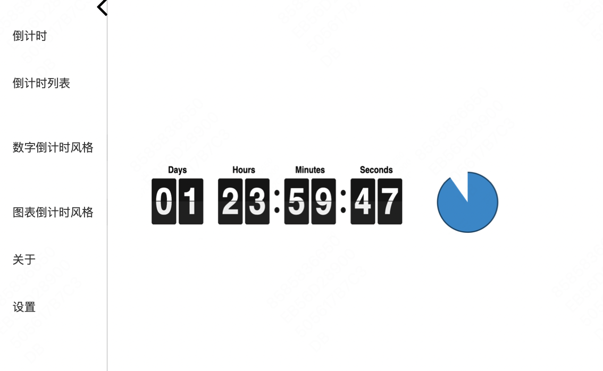

# Easy Timer

一个功能强大的 Flutter 计时器应用，提供优雅的界面和丰富的计时功能。

## 应用预览



## 功能说明

### 直观的用户界面
- 可收缩的侧边导航栏，默认展开
- 右侧是主要内容区域，收起左侧导航栏后，显示全部内容

### 双重倒计时显示
- 左侧是经典数字倒计时显示
- 右侧是图形话式倒计时显示
  - 可以是沙漏⏳类型的
  - 可以是pie饼图🍩类型的

### 计时功能
- 支持创建和管理多个计时器
- 自定义多个时间段设置
- 灵活的计时器命名和分类
- 支持计时器的暂停、继续和重置
- 每个计时器结束都可以设置不同的铃声🔔
- 每个计时器支持自动开始和手动开始模式

## UI说明
### tab「倒计时」
- 第一个tab「倒计时」，不是倒计时列表
- 显示当前正在进行的倒计时
- 左侧显示数字形式的倒计时
- 右侧显示图形化的倒计时进度
- 支持暂停、继续、重置等基本操作

### tab「倒计时列表」
- 展示所有已创建的倒计时器列表
- 支持新增、查看、编辑、删除倒计时器
  - 新增/编辑倒计时器
    - 可以设置是手动还是自动
    - 设置铃声等
- 支持列表排序和搜索功能
- 显示每个倒计时器的基本信息（名称、时长、状态、铃声等）

### tab「数字倒计时风格」
- 自定义倒计时显示样式
- 调整显示大小和位置
- 自定义颜色主题

### tab「图表倒计时风格」
- 切换图形化显示类型
  - 沙漏⏳样式
    - 支持自定义沙漏形状和大小
    - 可调节沙子下落速度和效果
    - 自定义沙漏颜色和材质
  - 饼图🍩样式
    - 支持设置饼图半径和厚度
    - 可选择顺时针或逆时针旋转
    - 自定义进度条颜色和渐变效果
- 显示设置
  - 设置透明度

### tab「关于」
- 显示应用版本信息
- 开发者信息
- 使用帮助和说明
- 问题反馈渠道

### tab「设置」
- 基本设置
  - 主题切换（暗/亮模式）
  - 语言设置
- 提醒设置
  - 铃声选择和管理
- 软件更新


## 快速开始

1. 克隆项目到本地：
```bash
git clone https://github.com/sqmw/easy_timer.git
```